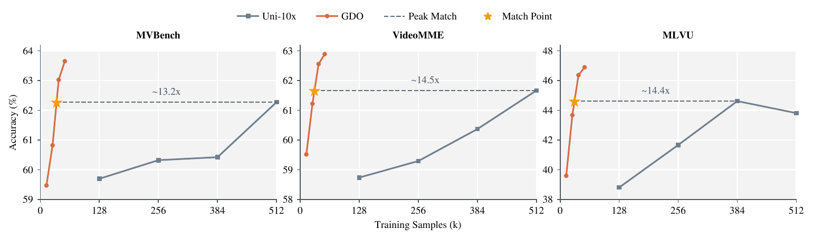
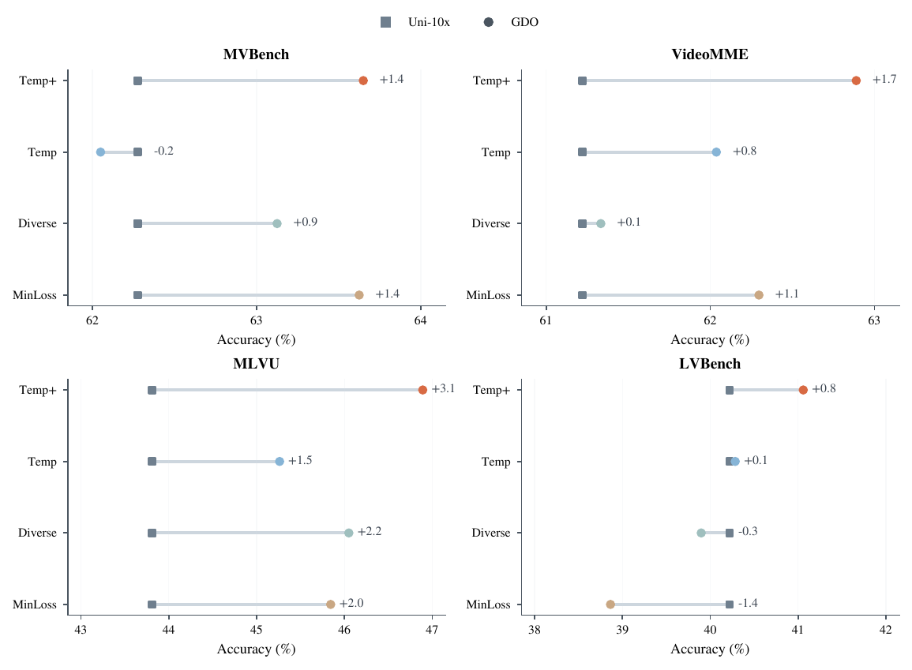
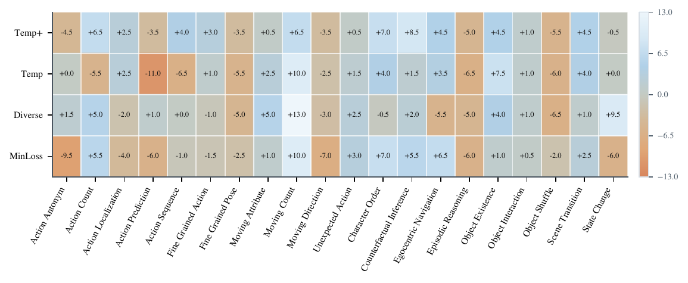

# Less Data, Faster Convergence: Goal-Driven Data Optimization for Multimodal Instruction Tuning

Accepted to **ECCV 2026**.

<p align="center">
  
</p>

This repository contains the code for our paper:

[**Less Data, Faster Convergence: Goal-Driven Data Optimization for Multimodal Instruction Tuning**](https://arxiv.org/abs/2603.12478)

by [**Rujie Wu**](https://rujiewu.github.io/), [**Haozhe Zhao**](https://haozhezhao.github.io/), [**Hai Ci**](https://haici.cc/), and [**Yizhou Wang**](https://cfcs.pku.edu.cn/english/people/faculty/yizhouwang/index.htm)

## Abstract

Multimodal instruction tuning is often compute-inefficient because training budget is spread over large mixed image-video pools whose utility is highly uneven. We present **Goal-Driven Data Optimization (GDO)**, a framework that computes six sample descriptors for each candidate and constructs optimized 1x training subsets for different goals. Under one fixed one-epoch Qwen3-VL-8B-Instruct training and evaluation recipe on 32 H20 GPUs, GDO uses far fewer training samples than Uni-10x while converging faster and reaching higher benchmark accuracy. Relative to the fixed 512k-sample Uni-10x baseline, GDO reaches the Uni-10x reference after 35.4k samples on MVBench, 26.6k on VideoMME, 27.3k on MLVU, and 34.7k on LVBench, while improving Accuracy by +1.38, +1.67, +3.08, and +0.84 pp, respectively. The gains are largest on MVBench and MLVU, while LVBench improves more modestly, consistent with its ultra-long-video setting and the mismatch between that benchmark and the short-video/image-dominant training pool. Across MinLoss, Diverse, Temp, and Temp+, stronger temporal pressure shifts the allocation toward video-centric supervision, with Temp+ giving the strongest overall profile. These results indicate that goal-driven data optimization improves sample efficiency and convergence under this fixed training contract. Code is available at https://github.com/rujiewu/GDO.

## Introduction

Mixed image-video instruction pools are large, redundant, and heterogeneous. Under a fixed training recipe, uniform sampling wastes budget on already-easy supervision and under-allocates the samples that actually improve temporal reasoning, motion understanding, and long-video behavior.

GDO addresses this problem under a strict comparison contract:

- compute six sample descriptors for every candidate in one shared pool
- rank candidates with a shared score
- build goal-specific optimized 1x subsets
- keep the backbone, SFT recipe, checkpoints, and evaluation fixed

This makes the observed gains interpretable as **data-allocation effects**, rather than changes in model or training recipe.

## Method

<p align="center">
  
</p>

GDO is a staged pipeline:

1. **Descriptor extraction** computes six sample descriptors over a shared multimodal candidate pool.
2. **Subset construction** applies a shared score and goal-specific feasibility presets to build optimized 1x subsets.
3. **Controlled comparison** trains and evaluates GDO and Uni-10x under the same fixed multimodal instruction-tuning contract.

The four GDO profiles are:

- `MinLoss`: favors easiest-to-fit supervision under the smallest budget
- `Diverse`: restores broader semantic and source coverage
- `Temp`: pushes the allocation toward temporally informative video supervision
- `Temp+`: applies the strongest temporal pressure among the four profiles

## Main Results

GDO reaches the Uni-10x reference substantially earlier on all four benchmarks while also improving final accuracy.

| Benchmark | Uni-10x | GDO | Delta (pp) | Peak Match | Reduction |
| --- | ---: | ---: | ---: | ---: | ---: |
| MVBench | 62.27 | 63.65 | +1.38 | 35.4k | 14.5x |
| VideoMME | 61.22 | 62.89 | +1.67 | 26.6k | 19.2x |
| MLVU | 43.81 | 46.89 | +3.08 | 27.3k | 18.8x |
| LVBench | 40.22 | 41.06 | +0.84 | 34.7k | 14.8x |

The four GDO profiles show distinct accuracy-budget trade-offs:

| Setting | 1x Samples | MVBench | VideoMME | MLVU | LVBench |
| --- | ---: | ---: | ---: | ---: | ---: |
| MinLoss | 12.9k | 63.63 (+1.35) | 62.30 (+1.07) | 45.84 (+2.03) | 38.86 (-1.36) |
| Diverse | 42.9k | 63.12 (+0.85) | 61.33 (+0.11) | 46.05 (+2.24) | 39.90 (-0.32) |
| Temp | 33.3k | 62.05 (-0.23) | 62.04 (+0.81) | 45.26 (+1.45) | 40.28 (+0.06) |
| Temp+ | 53.3k | **63.65 (+1.38)** | **62.89 (+1.67)** | **46.89 (+3.08)** | **41.06 (+0.84)** |

## Frontier Shifts by Goal

<p align="center">
  
</p>

Different allocation goals populate different parts of the accuracy-versus-budget frontier under the same train/eval contract. MinLoss occupies the earliest low-budget regime, Diverse restores broader coverage, and Temp/Temp+ push the operating point further toward temporally informative supervision.

## Subtask Analysis

The benchmark-level gains are concentrated on the temporal and reasoning subtasks that GDO is designed to prioritize.

### Temporal Subtask Gains

#### MinLoss

| Benchmark | Subtask | Uni-10x | GDO | Delta (pp) |
| --- | --- | ---: | ---: | ---: |
| MLVU | Order | 25.71 | 31.43 | +5.71 |
| MVBench | Character Order | 67.50 | 74.50 | +7.00 |
| VideoMME | Temporal Perception | 67.27 | 76.36 | +9.09 |
| MVBench | Moving Count | 53.00 | 63.00 | +10.00 |
| MLVU | SportsQA | 36.11 | 47.22 | +11.11 |

#### Diverse

| Benchmark | Subtask | Uni-10x | GDO | Delta (pp) |
| --- | --- | ---: | ---: | ---: |
| MLVU | SportsQA | 36.11 | 44.44 | +8.33 |
| MVBench | State Change | 61.00 | 70.50 | +9.50 |
| MLVU | Order | 25.71 | 35.71 | +10.00 |
| VideoMME | Temporal Perception | 67.27 | 78.18 | +10.91 |
| MVBench | Moving Count | 53.00 | 66.00 | +13.00 |

#### Temp

| Benchmark | Subtask | Uni-10x | GDO | Delta (pp) |
| --- | --- | ---: | ---: | ---: |
| MLVU | PlotQA | 44.00 | 48.00 | +4.00 |
| MLVU | Order | 25.71 | 30.00 | +4.29 |
| MLVU | SportsQA | 36.11 | 41.67 | +5.56 |
| VideoMME | Temporal Perception | 67.27 | 74.55 | +7.27 |
| MVBench | Moving Count | 53.00 | 63.00 | +10.00 |

#### Temp+

| Benchmark | Subtask | Uni-10x | GDO | Delta (pp) |
| --- | --- | ---: | ---: | ---: |
| MVBench | Character Order | 67.50 | 74.50 | +7.00 |
| MLVU | Order | 25.71 | 32.86 | +7.14 |
| MVBench | Counterfactual Inference | 59.50 | 68.00 | +8.50 |
| MLVU | SportsQA | 36.11 | 47.22 | +11.11 |
| VideoMME | Temporal Perception | 67.27 | 85.45 | +18.18 |

### Subtask Deltas

| Setting | MVB Motion | MVB Reasoning | VMM Temp. Perc. | MLVU Order | MLVU SportsQA | MLVU Ego |
| --- | ---: | ---: | ---: | ---: | ---: | ---: |
| MinLoss | -1.1 | +3.2 | +9.1 | +5.7 | +11.1 | -15.1 |
| Diverse | +1.5 | -2.2 | +10.9 | +10.0 | +8.3 | -5.7 |
| Temp | -1.2 | +0.6 | +7.3 | +4.3 | +5.6 | +1.9 |
| Temp+ | +0.8 | +3.8 | +18.2 | +7.1 | +11.1 | -3.8 |

<p align="center">
  
</p>

The full MVBench heatmap shows that GDO does not uniformly raise every subtask. Instead, it redistributes capability toward motion-, order-, and reasoning-related subtasks, while leaving some adverse subtasks unchanged or weaker.

## Ablation

The Temp+ ablation supports a distributed-mechanism interpretation rather than a single dominant score term.

| Ablation | MVBench | VideoMME | MLVU |
| --- | ---: | ---: | ---: |
| Temp+ | 63.65 | 62.89 | 46.89 |
| Temp+ w/o VDS | 63.12 (-0.53) | 61.78 (-1.11) | 47.60 (+0.71) |
| Temp+ w/o PPL | 63.30 (-0.35) | 61.81 (-1.07) | 47.00 (+0.11) |
| Temp+ w/o SC | 62.25 (-1.40) | 62.15 (-0.74) | 43.73 (-3.16) |
| Temp+ w/o VDS/PPL/SC | 61.65 (-2.00) | 62.04 (-0.85) | 47.06 (+0.17) |

## Repository Structure

```text
code/
  gdo/         # descriptor extraction, shard merging, and subset construction
  configs/     # goal presets and training/evaluation templates
  scripts/     # profiling, subset building, training, and evaluation
  ms-swift/    # training framework
  lmms-eval/   # evaluation framework
  assets/      # README figures
```

## Installation

Install the GDO package:

```bash
cd code
pip install -e .
```

Install `ms-swift` and `lmms-eval`:

```bash
bash scripts/setup.sh
```

The repository is tested against:

- [`ms-swift`](https://github.com/modelscope/ms-swift) `3.11.0.dev0`
- [`lmms-eval`](https://github.com/EvolvingLMMs-Lab/lmms-eval) `0.5.0`

## Data Format

The pipeline assumes the same JSONL structure used in the paper:

- `LLaVA-OneVision` rows contain `id`, `images`, and `messages`
- `LLaVA-Video` rows contain `id`, `video_id`, `images`, and `messages`
- `messages` alternate user and assistant turns so that question-answer parsing remains stable

The subset builder writes JSONL rows that are directly usable as SFT inputs after frame resampling.

## Build GDO Subsets

### 1. Extract six sample descriptors

```bash
export ONEVISION_PATH=/path/to/llava_onevision.jsonl
export VIDEO_PATH=/path/to/llava_video.jsonl
export MODEL_PATH=/path/to/Qwen3-VL-8B-Instruct
bash scripts/profile_six_metrics.sh
```

### 2. Merge descriptor shards

```bash
bash scripts/merge_metrics.sh
```

This stage writes:

- `outputs/metrics/sixd_metrics_merged.jsonl`
- `outputs/metrics/sixd_metrics_merge_report.json`

### 3. Build one profile

```bash
export ONEVISION_PATH=/path/to/llava_onevision.jsonl
export VIDEO_PATH=/path/to/llava_video.jsonl
export METRICS_JSONL=outputs/metrics/sixd_metrics_merged.jsonl
bash scripts/build_profile.sh configs/temp_plus.env
```

Each profile writes:

- `outputs/<profile>/gdo_1x_<frames>f.jsonl`
- `outputs/<profile>/uni_10x_<frames>f.jsonl`
- `outputs/<profile>/report.json`
- `outputs/<profile>/profile.json`

To build all four profiles:

```bash
bash scripts/build.sh
```

## Training

[`scripts/train_sft.sh`](scripts/train_sft.sh) wraps one-epoch `Qwen3-VL-8B-Instruct` SFT with [`ms-swift`](https://github.com/modelscope/ms-swift).

```bash
mkdir -p local
cp configs/train_qwen3_vl_8b_instruct.env local/train.env
# edit MODEL_PATH, DATA_PATH, and OUTPUT_DIR
bash scripts/train_sft.sh local/train.env
```

The training contract matches the paper: one backbone, one SFT recipe, one checkpoint cadence, and only the training subset changes.

## Evaluation

[`scripts/eval_lmms.sh`](scripts/eval_lmms.sh) wraps [`lmms-eval`](https://github.com/EvolvingLMMs-Lab/lmms-eval) for the four paper benchmarks.

```bash
mkdir -p local
cp configs/eval_longvideo.env local/eval.env
# edit CKPT_PATH and OUTPUT_ROOT
bash scripts/eval_lmms.sh local/eval.env
```

The default task list is:

- `mvbench`
- `videomme`
- `mlvu_test`
- `lvbench`

If `CKPT_PATH` contains multiple `checkpoint-*` directories, the wrapper evaluates each checkpoint in sorted order. If it points to one exported model directory, the wrapper evaluates that directory directly.

## Examples

The command below builds one profile, trains both `GDO` and `Uni-10x`, and evaluates both runs:

```bash
bash scripts/run_profile_pipeline.sh \
  configs/temp_plus.env \
  configs/train_qwen3_vl_8b_instruct.env \
  configs/eval_longvideo.env
```

## Acknowledgement

This codebase depends on [`ms-swift`](https://github.com/modelscope/ms-swift) and [`lmms-eval`](https://github.com/EvolvingLMMs-Lab/lmms-eval). Please also cite these frameworks if you use this codebase.

## Citation

```bibtex
@misc{wu2026datafasterconvergencegoaldriven,
  title         = {Less Data, Faster Convergence: Goal-Driven Data Optimization for Multimodal Instruction Tuning},
  author        = {Rujie Wu and Haozhe Zhao and Hai Ci and Yizhou Wang},
  year          = {2026},
  eprint        = {2603.12478},
  archivePrefix = {arXiv},
  primaryClass  = {cs.CV},
  url           = {https://arxiv.org/abs/2603.12478}
}
```
